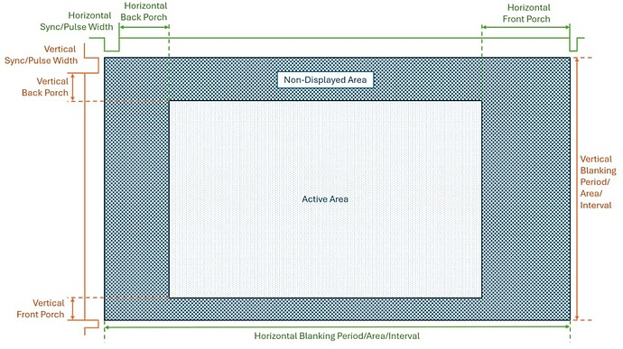

# Notes on editing dtb file to achieve 60fps on the m22pro display.

## DISCLAIMER: if something goes wrong the below can brick Your device, do it at your own risk! 

## ONLY VALID ON M22PRO, DON'T DO IT ON M21, IT WILL BRICK THE DEVICE!

The stock dtb set the screen parameters at 38fps on the m22pro
<pre>
cat /sys/class/disp/disp/attr/sys 

screen 0:
de_rate 300000000 hz, ref_fps:38
mgr0: 1080x1920 fmt[rgb] cs[0x204] range[full] eotf[0x4] bits[8bits] err[0] force_sync[0] unblank direct_show[false] iommu[1]
dmabuf: cache[0] cache max[0] umap skip[0] overflow[0]
	lcd output	backlight( 80)	fps:38.0	1080x1920
	err:402	skip:1	irq:3628	vsync:0	vsync_skip:0	
</pre>

the u-boot partition then dtb file is in mtdblock0, it can be extracted with this command:

<pre>
dd if=/dev/mtdblock0 of=/mnt/SDCARD/mtdblock0
</pre>

binwalk can be used to extract the dts file:

<pre>
binwalk -e mtdblock0 

                                                 ./extractions/mtdblock0
----------------------------------------------------------------------------------------------------------------------------------------------------
DECIMAL                            HEXADECIMAL                        DESCRIPTION
----------------------------------------------------------------------------------------------------------------------------------------------------
320452                             0x4E3C4                            CRC32 polynomial table, little endian
549560                             0x862B8                            Device tree blob (DTB), version: 17, CPU ID: 0, total size: 18254 bytes
815632                             0xC7210                            SHA256 hash constants, little endian
876544                             0xD6000                            Device tree blob (DTB), version: 17, CPU ID: 0, total size: 60608 bytes
----------------------------------------------------------------------------------------------------------------------------------------------------
[+] Extraction of dtb data at offset 0x862B8 completed successfully
[+] Extraction of dtb data at offset 0xD6000 completed successfully
----------------------------------------------------------------------------------------------------------------------------------------------------

Analyzed 1 file for 85 file signatures (187 magic patterns) in 166.0 milliseconds
</pre>

it creates a couple of folders in ./extractions/mtdblock0
<pre>
└── mtdblock0.extracted
    ├── 862B8
    │   └── system.dtb
    └── D6000
        └── system.dtb
</pre>
these called dtb files are actually already decompiled dts files, the one we need is the one present in the D6000 folder

orig.dts in this folder is the system.dtb extracted and renamed.

I've changed some screen timing values in the lcd node and recompiled it with
<pre>
dtc -I dts -O dtb -o edited.dtb edited.dts  
</pre>

to replace the original dtb file make a copy of the stock mtdblock0 then patch it:
<pre>
cp mtdblock0 mtdblock0_edited
dd if=edited.dtb of=mtdblock0_edited bs=1 seek=876544 conv=notrunc
</pre>

a quick check with binwalk to ensure the mtdblock file structure is correct:
<pre>
binwalk mtdblock0_edited  

                                                    mtdblock0_edited
----------------------------------------------------------------------------------------------------------------------------------------------------
DECIMAL                            HEXADECIMAL                        DESCRIPTION
----------------------------------------------------------------------------------------------------------------------------------------------------
320452                             0x4E3C4                            CRC32 polynomial table, little endian
549560                             0x862B8                            Device tree blob (DTB), version: 17, CPU ID: 0, total size: 18254 bytes
815632                             0xC7210                            SHA256 hash constants, little endian
876544                             0xD6000                            Device tree blob (DTB), version: 17, CPU ID: 0, total size: 58503 bytes
----------------------------------------------------------------------------------------------------------------------------------------------------

Analyzed 1 file for 85 file signatures (187 magic patterns) in 523.0 milliseconds
</pre>

the file mtdblock0_edited can now be copied to the sdcard and running this command overwrites the mtdclock0, I use a modified tomato script to launch it at next boot, however it can work even as a tool.
<pre>
dd if=/mnt/SDCARD/mtdblock0_edited of=/dev/mtdblock0 bs=4096 conv=fsync
</pre>

once flashed the device must be rebooted to make the flash effective.
now the display runs at 60fps

<pre>
cat /sys/class/disp/disp/attr/sys 

screen 0:
de_rate 300000000 hz, ref_fps:60
mgr0: 1080x1920 fmt[rgb] cs[0x204] range[full] eotf[0x4] bits[8bits] err[0] force_sync[0] unblank direct_show[false] iommu[1]
dmabuf: cache[0] cache max[0] umap skip[0] overflow[0]
	lcd output	backlight( 80)	fps:60.2	1080x1920
	err:277	skip:0	irq:9095	vsync:0	vsync_skip:0		
</pre>

here the details of the changes:
<pre>
		lcd0@5461000 {
			compatible = "allwinner,sunxi-lcd0";
			reg = <0x00 0x5461000 0x00 0xfff>;
			pinctrl-names = "active", "sleep";
			status = "okay";
			lcd_used = <0x01>;
			lcd_driver_name = "hx8399";
			lcd_backlight = <0x4b>;
			lcd_if = <0x04>;
			lcd_x = <0x438>;
			lcd_y = <0x780>;
			lcd_width = <0x4b>;
			lcd_height = <0x3f>;
			lcd_dclk_freq = <0xa2>;     /* ~162 MHz (Alzato per compensare il VT più lungo) orig= <0x5a> */
			lcd_pwm_used = <0x01>;
			lcd_pwm_ch = <0x07>;
			lcd_pwm_freq = <0xc350>;
			lcd_pwm_pol = <0x00>;
			lcd_pwm_max_limit = <0xff>;
			lcd_gpio_0 = <0x13 0x06 0x12 0x01 0x00 0x03 0x01>;
			lcd_hbp = <0x78>;            /* 120 dec   orig= <0x20>*/
			lcd_ht = <0x546>;            /* 1350 dec (1080 + 270) orig= <0x4ce> */
			lcd_hspw = <0x14>;           /* 20 dec orig= <0x08>*/
			lcd_vbp = <0x05>;           /* 5 dec - Minimo indispensabile per non avere schermo nero orig= <0x07>*/
			lcd_vt = <0x7e0>;           /* 2016dec - (1920 + 3 + 5 + 88 di blanking totale) orig= <0x799>*/
			lcd_vspw = <0x03>;      	/* 3 dec clock width orig= 0x06*/
			lcd_dsi_if = <0x00>;
			lcd_dsi_lane = <0x04>;
			lcd_dsi_format = <0x00>;
			lcd_dsi_te = <0x00>;
			lcd_dsi_eotp = <0x00>;
			lcd_frm = <0x00>;
			lcd_hv_clk_phase = <0x00>;
			lcd_hv_sync_polarity = <0x00>;
			lcd_gamma_en = <0x00>;
			lcd_bright_curve_en = <0x00>;
			lcd_cmap_en = <0x00>;
			deu_mode = <0x00>;
			lcdgamma4iep = <0x16>;
			smart_color = <0x5a>;
			pinctrl-0 = <0x4d>;
			pinctrl-1 = <0x4e>;
		};
</pre>

With the help of google gemini I've change the pixclock frequency from 90MHz to 162MHz plus I've adjusted some timing values to make the image stable and centered on the display

some references:

https://forum.digikey.com/t/lcd-tft-displays-timing-parameters-explained/47147

https://linux-sunxi.org/LCD

During the test I bricked mine as sometimes with the wrong values the screen refused to switch on, ususally is not a problem if you let enough time to the flashing process to finish (I suggest to wait at least 2 minutes before rebooting), I didn't wait enough resulting in corrupted mtd0 partition corrupted so I won a bricked device. 
I've been able to recover it by using a nor spi chip reader which I previously used to make the full backup of the system flash.

this is the modded device I used
https://www.youtube.com/watch?v=qXLmrmb0BJc&list=PLtJQzQbL-WYI-gBoDxbK_ZHbsFIBjm3uJ&index=3

with this sw tool to read and write the flash chip.

https://github.com/McMCCRU/SNANDer

